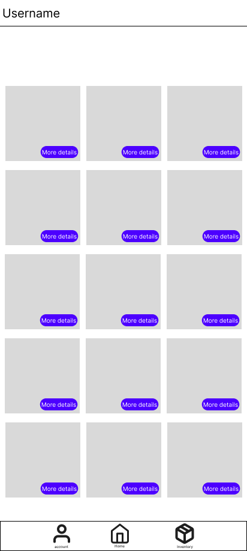
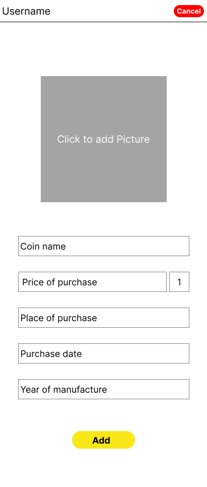
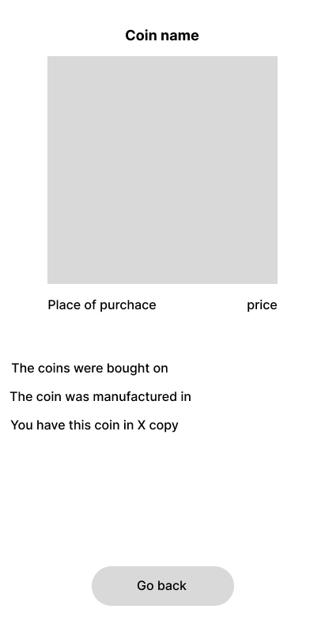

# Collector-Coin
CollectorCoin est une application développée en Flutter permettant de stocker des pièces de collection, comme les pièce touristique de la monnaies de Paris.

<h1 style="color: red"> Application en cours de devellopement</h1>

<h1> Page d'accueil </h1>

 
 
<h1> Page ou sont stocker l'ensemble des pièce </h1>

 
 
<h1> Page d'ajout d'une pièce </h1>

 
 
<h1> Fenetre de detaille d'une pièce </h1>

 
 